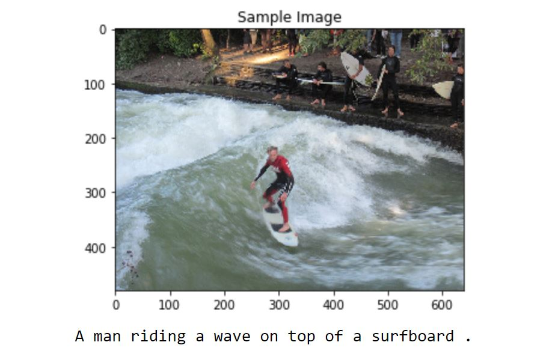
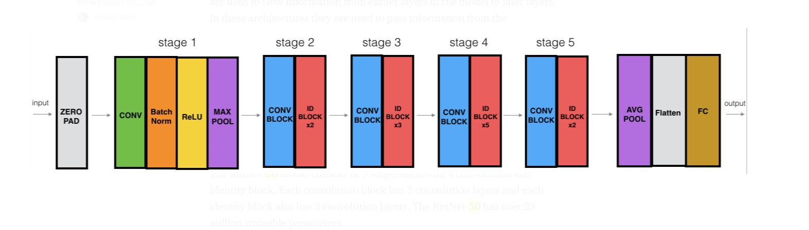

# Computer Vision CNN-RNN-Image_to_Caption
How to create a caption that describes an image with Deep Learning? With a CNN and a RNN combined.

# UDACITY - Computer Vision Nanodegree Project 2 - Image-Captioning

Uses a CNN Encoder and a RNN Decoder to generate captions for input images. 
The Project has been reviewed by Udacity and graded Meets Specifications.  

Here's a sumary of the steps involved.

- Dataset used is the COCO data set by Microsoft.
- Feature vectors for images are generated using a CNN based on the ResNet-50 architecture by Google. 
- Word embeddings are generated from captions for training images. NLTK was used for working with processing of captions.
- Implemented an RNN decoder using LSTM cells.
- Trained the network for nearly 3 hrs using GPU to achieve average loss of about 2%.
- Obtained outputs for some test images to understand efficiency of the trained network. 

